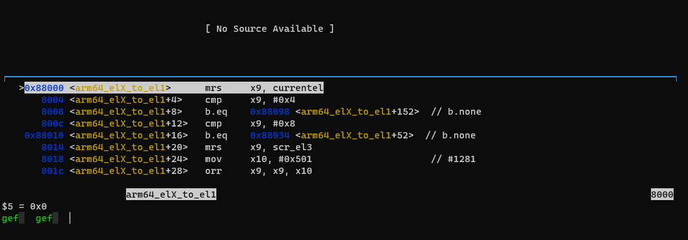
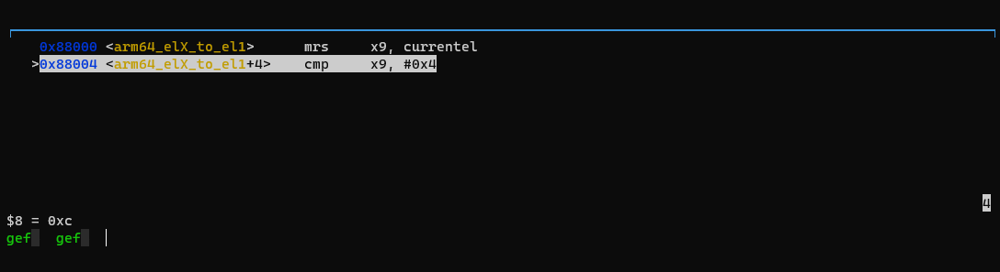
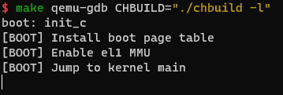

# Lab1

## 信息

姓名：杨景凯
学号：520021910550
邮箱：sxqxyjk2020@sjtu.edu.cn

## 思考题

- 思考题 1：阅读 _start 函数的开头，尝试说明 ChCore 是如何让其中一个核首先进入初始化流程，并让其他核暂停执行的。

首先直接定义好要执行的核心为0，然后通过`mpidr_el1`来读取当前cpu核心序号，与`0xFF`按位与之后将其与0比较，如果为0，跳转到函数`primary`，否则会将当前核心挂起，等待C代码中`start_kernel(secondary_boot_flag)`执行，从而进行secondary boot。

- 思考题 4：结合此前 ICS 课的知识，并参考 kernel.img 的反汇编（通过 aarch64-linux-gnu-objdump -S 可获得），说明为什么要在进入 C 函数之前设置启动栈。如果不设置，会发生什么？

因为C函数的执行需要栈存储stack pointer以及申请栈上变量。如果不设置，c函数执行时读取的stack pointer值为0（或者其他不正确的值），在执行代码时stack pointer值减少，使得读取到非法内存。

- 思考题 5：在实验 1 中，其实不调用 clear_bss 也不影响内核的执行，请思考不清理 .bss 段在之后的何种情况下会导致内核无法工作。

不清理也可以运行的原因是默认其初始即为0。但是如果之后仍然使用这段空间，而且不是全为0，则会错误地将已经初始化为0的全局变量或静态变量和未初始化的全局变量或静态变量错误初始化，使得代码执行出错，内核无法工作。

## 练习题

- 练习题 2：在 arm64_elX_to_el1 函数的 LAB 1 TODO 1 处填写一行汇编代码，获取 CPU 当前异常级别。

填写代码为：
```asm
mrs x9, CurrentEL
```
其中mrs指的是将系统寄存器的值复制到用户寄存器，而`CurrentEL`寄存器储存了当前的异常级别。
执行前后分别如下图：




- 练习题 3：在 arm64_elX_to_el1 函数的 LAB 1 TODO 2 处填写大约 4 行汇编代码，设置从 EL3 跳转到 EL1 所需的 elr_el3 和 spsr_el3 寄存器值。具体地，我们需要在跳转到 EL1 时暂时屏蔽所有中断、并使用内核栈（sp_el1 寄存器指定的栈指针）。

填写代码为：
```asm
adr x9, .Ltarget
msr elr_el3, x9
mov x9, SPSR_ELX_DAIF | SPSR_ELX_EL1H
msr spsr_el3, x9
```
使用`adr`指令将`.Ltarget`的地址加载到x9寄存器，然后`msr`指令将用户寄存器的值复制到系统寄存器，将返回地址写入`elr_el3`中。使用`SPSR_ELX_DAIF | SPSR_ELX_EL1H`标志暂时屏蔽所有中断，使用内核栈，并将其写入`spsr_el3`中。

- 练习题 6：在 kernel/arch/aarch64/boot/raspi3/peripherals/uart.c 中 LAB 1 TODO 3 处实现通过 UART 输出字符串的逻辑。

填写代码为：
```c++
while (*str != '\0') {
        early_uart_send(*str);
        str++;
}
```
使用循环不断读取str中的字符，将其发送至UART。


- 练习题 7：在 kernel/arch/aarch64/boot/raspi3/init/tools.S 中 LAB 1 TODO 4 处填写一行汇编代码，以启用 MMU。

填写代码为：
```asm
orr     x8, x8, #SCTLR_EL1_M
```
此时按下中断，并单步执行。不断在地址0x200处循环。
