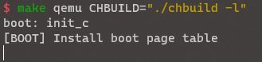

# Lab2

## 信息

姓名：杨景凯
学号：520021910550
邮箱：sxqxyjk2020@sjtu.edu.cn

## 思考题

- 思考题 1：请思考多级页表相比单级页表带来的优势和劣势（如果有的话），并计算在 AArch64 页表中分别以 4KB 粒度和 2MB 粒度映射 0～4GB 地址范围所需的物理内存大小（或页表页数量）。

    - 优势：
      1. 使得不需要全部映射内存空间，而只需要映射需要的部分。也就是说，页表形成的树可以不是一棵完全树。从而减少占据的空间。
      2. 可以尽可能扩大所能映射的空间，不局限于物理内存，进而屏蔽了物理内存大小的影响。
      3. 内存不需要连续，减少内存碎片，增加内存利用率。
   
    - 劣势：
      1. 增加了访问内存需要的深度和次数。
      2. TLB Miss次数增加。
   
当以4KB映射时，需要$2^{20}$页，进而有$2^{20}$个三级页表项，$2^{11}$个三级页表页，$2^{11}$个二级页表项，$2^{2}$个二级页表，$2^{2}$个一级页表项，，$1$个一级页表，$1$个零级页表。共$2^{11} + 2^{2} + 1 + 1 = 2054$页。

当以2MB映射时，需要$2^{11}$页，进而有$2^{11}$个二级页表项，$2^{2}$个二级页表，$2^{2}$个一级页表项，，$1$个一级页表，$1$个零级页表。共$2^{2} + 1 + 1 = 6$页。

- 思考题 3：请思考在 init_boot_pt 函数中为什么还要为低地址配置页表，并尝试验证自己的解释。

在此之前，使用的是低地址的物理内存。在此时为低地址配置页表，之后激活MMU为低地址分配页表，保证了从物理地址切换到虚拟地址的连贯性。否则会因为地址没有分配，在执行之后的指令时出错。

验证：将代码注释掉，运行，发现无法继续执行，无法访存。



- 思考题 4：请解释 ttbr0_el1 与 ttbr1_el1 是具体如何被配置的，给出代码位置，并思考页表基地址配置后为何需要ISB指令。
通过`init_boot_pt`配置好`boot_ttbr0_l0`和`boot_ttbr1_l0`后，通过汇编将地址传入系统寄存器`ttbr0_el1`和`ttbr1_el1`。
```asm
	adrp    x8, boot_ttbr0_l0
	msr     ttbr0_el1, x8
	adrp    x8, boot_ttbr1_l0
	msr     ttbr1_el1, x8
```
ISB指令会冲刷流水线，然后从指令高速缓存或内存中重新预存指令。这使得对系统寄存器的更改对下文可见，也就是说，使得对之后的指令，都可以得到上述已经更改的系统寄存器`ttbr0_el1`和`ttbr1_el1`的新值。

- 思考题 8：阅读 Arm Architecture Reference Manual，思考要在操作系统中支持写时拷贝（Copy-on-Write，CoW）需要配置页表描述符的哪个/哪些字段，并在发生缺页异常（实际上是 permission fault）时如何处理。

需要配置AP字段为Read-only。

当因为权限不足触发缺页异常时，查看AP字段发现是由于尝试修改只读内存造成的，于是会真正进行分配一个物理页，将AP字段配置为可读可写，通过MMU重新映射，进而在第二次访问时不会造成缺页异常。

- 思考题 9：为了简单起见，在 ChCore 实验中没有为内核页表使用细粒度的映射，而是直接沿用了启动时的粗粒度页表，请思考这样做有什么问题。

1. 使用粗粒度页表很大可能使用不完，进而造成内存的浪费。
2. 由于在单页内内存必须连续，因此可能造成内存碎片，进而降低内存的利用率。
3. 权限配置问题。不同段的权限不同，使用统一的权限配置使得不具备细粒度的管理。

## 练习题

- 练习题 2：请在 init_boot_pt 函数的 LAB 2 TODO 1 处配置内核高地址页表（boot_ttbr1_l0、boot_ttbr1_l1 和 boot_ttbr1_l2），以 2MB 粒度映射。

首先为KERNEL_VADDR设置L0和L1页表项，而对于L2和L3而言，其只看后面的地址，因此可以直接使用分配非KERNEL_VADDR时的分配方式。

```c++
        /* Step 1: set L0 and L1 page table entry */
        vaddr = KERNEL_VADDR;
        boot_ttbr1_l0[GET_L0_INDEX(vaddr)] = ((u64)boot_ttbr1_l1) | IS_TABLE
                                             | IS_VALID | NG;
        boot_ttbr1_l1[GET_L1_INDEX(vaddr)] = ((u64)boot_ttbr1_l2) | IS_TABLE
                                             | IS_VALID | NG;

        /* Step 2: map PHYSMEM_START ~ PERIPHERAL_BASE with 2MB granularity */
        for (vaddr = PHYSMEM_START; vaddr < PERIPHERAL_BASE; vaddr += SIZE_2M) {
                boot_ttbr1_l2[GET_L2_INDEX(vaddr)] =
                        (vaddr) /* low mem, va = pa */
                        | UXN /* Unprivileged execute never */
                        | ACCESSED /* Set access flag */
                        | NG /* Mark as not global */
                        | INNER_SHARABLE /* Sharebility */
                        | NORMAL_MEMORY /* Normal memory */
                        | IS_VALID;
        }

        /* Step 2: map PERIPHERAL_BASE ~ PHYSMEM_END with 2MB granularity */
        for (vaddr = PERIPHERAL_BASE; vaddr < PHYSMEM_END; vaddr += SIZE_2M) {
                boot_ttbr1_l2[GET_L2_INDEX(vaddr)] =
                        (vaddr) /* low mem, va = pa */
                        | UXN /* Unprivileged execute never */
                        | ACCESSED /* Set access flag */
                        | NG /* Mark as not global */
                        | DEVICE_MEMORY /* Device memory */
                        | IS_VALID;
        }
```

- 练习题 5：完成 kernel/mm/buddy.c 中的 split_page、buddy_get_pages、merge_page 和 buddy_free_pages 函数中的 LAB 2 TODO 2 部分，其中 buddy_get_pages 用于分配指定阶大小的连续物理页，buddy_free_pages 用于释放已分配的连续物理页。

1. split_page函数递归地分割页，直到找到满足的层数。

```c++
static struct page *split_page(struct phys_mem_pool *pool, u64 order,
                               struct page *page)
{
        /* LAB 2 TODO 2 BEGIN */
        /*
         * Hint: Recursively put the buddy of current chunk into
         * a suitable free list.
         */
        // if this page is not needed to be split, return it
        if (page->order == order) {
                page->allocated = 1;
                return page;
        }
        // if this page is needed to be split, split it
        // change order and allocated
        page->order--;
        page->allocated = 0;
        // get the buddy and change order and allocated
        struct page *buddy = get_buddy_chunk(pool, page);
        buddy->order = page->order;
        buddy->allocated = 0;
        // put the buddy into the free list
        list_add(&(buddy->node), &(pool->free_lists[buddy->order].free_list));
        pool->free_lists[buddy->order].nr_free++;
        // split the page
        return split_page(pool, order, page);

        /* LAB 2 TODO 2 END */
}
```

2. buddy_get_pages函数从free_lists里找到真正分配的order，然后交给split_page函数分割得到页。
```c++
struct page *buddy_get_pages(struct phys_mem_pool *pool, u64 order)
{
        /* LAB 2 TODO 2 BEGIN */
        /*
         * Hint: Find a chunk that satisfies the order requirement
         * in the free lists, then split it if necessary.
         */
        // get real order
        int real_order = order;
        while (real_order < BUDDY_MAX_ORDER) {
                if (pool->free_lists[real_order].nr_free > 0)
                        break;
                real_order++;
        }
        // if no chunk can be found, return NULL
        if (real_order >= BUDDY_MAX_ORDER)
                return NULL;
        // get the page from the free list
        struct list_head *page_head =
                pool->free_lists[real_order].free_list.next;
        // remove the page from the free list
        list_del(page_head);
        pool->free_lists[real_order].nr_free--;
        // get the page
        struct page *page = list_entry(page_head, struct page, node);
        return split_page(pool, order, page);

        /* LAB 2 TODO 2 END */
}
```

3. merge_page函数递归地检查其buddy，如果可以merge则merge，否则返回这个页。
```c++
static struct page *merge_page(struct phys_mem_pool *pool, struct page *page)
{
        /* LAB 2 TODO 2 BEGIN */
        /*
         * Hint: Recursively merge current chunk with its buddy
         * if possible.
         */
        // get the buddy
        struct page *buddy = get_buddy_chunk(pool, page);
        if (page->order == BUDDY_MAX_ORDER - 1 || buddy == NULL
            || buddy->allocated == 1 || page->order != buddy->order) {
                // add the page into the free list
                list_add(&(page->node),
                         &(pool->free_lists[page->order].free_list));
                pool->free_lists[page->order].nr_free++;
                return page;
        } else {
                // remove the buddy from the free list
                list_del(&(buddy->node));
                pool->free_lists[buddy->order].nr_free--;
                // change order and allocated
                u64 after_merge_addr = (u64)page_to_virt(page)
                                       & (u64)page_to_virt(buddy);
                struct page *after_merge_page =
                        virt_to_page((void *)after_merge_addr);
                after_merge_page->order = page->order + 1;
                after_merge_page->allocated = 0;
                // merge the page
                return merge_page(pool, after_merge_page);
        }

        /* LAB 2 TODO 2 END */
}
```

4. buddy_free_pages函数将其位设置为free，并尝试merge。
```c++
void buddy_free_pages(struct phys_mem_pool *pool, struct page *page)
{
        /* LAB 2 TODO 2 BEGIN */
        /*
         * Hint: Merge the chunk with its buddy and put it into
         * a suitable free list.
         */
        page->allocated = 0;
        merge_page(pool, page);

        /* LAB 2 TODO 2 END */
}
```

- 练习题 6：完成 kernel/arch/aarch64/mm/page_table.c 中的 get_next_ptp、 query_in_pgtbl、map_range_in_pgtbl、unmap_range_in_pgtbl 函数中的 LAB 2 TODO 3 部分，后三个函数分别实现页表查询、映射、取消映射操作，其中映射和取消映射以 4KB 页为粒度。

1. get_next_ptp函数中此部分申请页并配置页。
```c++
                        // alloc a new page table page
                        new_ptp = get_pages(0);
                        memset(new_ptp, 0, PAGE_SIZE);
                        new_ptp_paddr = virt_to_phys(new_ptp);

                        // set the attr `is_valid`, `is_table` and
                        // `next_table_addr` of new pte
                        new_pte_val.pte = 0;
                        new_pte_val.table.is_valid = 1;
                        new_pte_val.table.is_table = 1;
                        new_pte_val.table.next_table_addr = new_ptp_paddr
                                                            >> PAGE_SHIFT;

                        // set the new pte
                        entry->pte = new_pte_val.pte;
```

2. query_in_pgtbl函数对每级页表遍历，直到遇到大页或最终4K页。
```c++
int query_in_pgtbl(void *pgtbl, vaddr_t va, paddr_t *pa, pte_t **entry)
{
        /* LAB 2 TODO 3 BEGIN */
        /*
         * Hint: Walk through each level of page table using `get_next_ptp`,
         * return the pa and pte until a L0/L1 block or page, return
         * `-ENOMAPPING` if the va is not mapped.
         */
        // walk through each level of page table
        ptp_t *cur_ptp = pgtbl;
        for (int i = 0; i < TOT_LEVEL; i++) {
                ptp_t *next_ptp;
                pte_t *pte;
                paddr_t offset, pfn;
                int ret = get_next_ptp(cur_ptp, i, va, &next_ptp, &pte, false);
                // return the pa and pte until a L0/L1 block or page
                switch (ret) {
                case -ENOMAPPING:
                        return -ENOMAPPING;
                        break;
                case BLOCK_PTP:
                        switch (i) {
                        case 1:
                                offset = GET_VA_OFFSET_L1(va);
                                pfn = pte->l1_block.pfn;
                                *pa = (pfn << L1_INDEX_SHIFT) | offset;
                                break;
                        case 2:
                                offset = GET_VA_OFFSET_L2(va);
                                pfn = pte->l2_block.pfn;
                                *pa = (pfn << L2_INDEX_SHIFT) | offset;
                                break;
                        default:
                                break;
                        }
                        *entry = pte;
                        return 0;
                        break;
                case NORMAL_PTP:
                        switch (i) {
                        case 3:
                                offset = GET_VA_OFFSET_L3(va);
                                pfn = pte->l3_page.pfn;
                                *pa = (pfn << L3_INDEX_SHIFT) | offset;
                                *entry = pte;
                                return 0;
                                break;
                        default:
                                break;
                        }
                        break;
                default:
                        break;
                }
                cur_ptp = next_ptp;
        }
        return -ENOMAPPING;

        /* LAB 2 TODO 3 END */
}
```

3. map_range_in_pgtbl函数找到4K页，进行分配。
```c++
int map_range_in_pgtbl(void *pgtbl, vaddr_t va, paddr_t pa, size_t len,
                       vmr_prop_t flags)
{
        /* LAB 2 TODO 3 BEGIN */
        /*
         * Hint: Walk through each level of page table using `get_next_ptp`,
         * create new page table page if necessary, fill in the final level
         * pte with the help of `set_pte_flags`. Iterate until all pages are
         * mapped.
         */
        size_t has_mapped = 0;
        while (has_mapped < len) {
                ptp_t *cur_ptp = pgtbl;
                ptp_t *next_ptp;
                pte_t *tmp_pte;
                // get right ptp
                for (int i = 0; i < INDEX_MAP_4K; i++) {
                        get_next_ptp(cur_ptp,
                                     i,
                                     va + has_mapped,
                                     &next_ptp,
                                     &tmp_pte,
                                     true);
                        cur_ptp = next_ptp;
                }
                // fill in the right pte
                u32 index = GET_L3_INDEX(va + has_mapped);
                pte_t *entry = &(cur_ptp->ent[index]);
                set_pte_flags(
                        entry, flags, va >= KBASE ? KERNEL_PTE : USER_PTE);
                entry->l3_page.is_page = 1;
                entry->l3_page.is_valid = 1;
                entry->l3_page.pfn = (pa + has_mapped) >> 12;
                has_mapped += (1u << 12);
        }
        return 0;

        /* LAB 2 TODO 3 END */
}
```
4. unmap_range_in_pgtbl函数找到4K页，进行取消分配。
```c++
int unmap_range_in_pgtbl(void *pgtbl, vaddr_t va, size_t len)
{
        /* LAB 2 TODO 3 BEGIN */
        /*
         * Hint: Walk through each level of page table using `get_next_ptp`,
         * mark the final level pte as invalid. Iterate until all pages are
         * unmapped.
         */
        size_t has_mapped = 0;
        while (has_mapped < len) {
                ptp_t *cur_ptp = pgtbl;
                ptp_t *next_ptp;
                pte_t *tmp_pte;
                // get right ptp
                for (int i = 0; i < INDEX_MAP_4K; i++) {
                        get_next_ptp(cur_ptp,
                                     i,
                                     va + has_mapped,
                                     &next_ptp,
                                     &tmp_pte,
                                     true);
                        cur_ptp = next_ptp;
                }
                // fill in the right pte
                u32 index = GET_L3_INDEX(va + has_mapped);
                pte_t *entry = &(next_ptp->ent[index]);
                entry->l3_page.is_valid = 0;
                has_mapped += (1u << 12);
        }
        return 0;

        /* LAB 2 TODO 3 END */
}
```

- 练习题 7：完成 kernel/arch/aarch64/mm/page_table.c 中的 map_range_in_pgtbl_huge 和 unmap_range_in_pgtbl_huge 函数中的 LAB 2 TODO 4 部分，实现大页（2MB、1GB 页）支持。

1. 类似于map_range_in_pgtbl函数，map_range_in_pgtbl_huge针对不同剩余长度分配不同页。
```c++
int map_range_in_pgtbl_huge(void *pgtbl, vaddr_t va, paddr_t pa, size_t len,
                            vmr_prop_t flags)
{
        /* LAB 2 TODO 4 BEGIN */
        size_t has_mapped = 0;
        while (has_mapped < len) {
                int level_index;
                if (len >= (1 << 30) + has_mapped)
                        level_index = INDEX_MAP_1G;
                else if (len >= (1 << 21) + has_mapped)
                        level_index = INDEX_MAP_2M;
                else
                        level_index = INDEX_MAP_4K;

                ptp_t *cur_ptp = pgtbl;
                ptp_t *next_ptp;
                pte_t *tmp_pte;
                // get right ptp
                for (int i = 0; i < level_index; i++) {
                        get_next_ptp(cur_ptp,
                                     i,
                                     va + has_mapped,
                                     &next_ptp,
                                     &tmp_pte,
                                     true);
                        cur_ptp = next_ptp;
                }
                // fill in the right pte
                u32 index;
                pte_t *entry;
                switch (level_index) {
                case INDEX_MAP_1G:
                        index = GET_L1_INDEX(va + has_mapped);
                        entry = &(cur_ptp->ent[index]);
                        set_pte_flags(entry,
                                      flags,
                                      va >= KBASE ? KERNEL_PTE : USER_PTE);
                        entry->l1_block.is_table = 0;
                        entry->l1_block.is_valid = 1;
                        entry->l1_block.pfn = (pa + has_mapped) >> 30;
                        has_mapped += (1u << 30);
                        break;
                case INDEX_MAP_2M:
                        index = GET_L2_INDEX(va + has_mapped);
                        entry = &(cur_ptp->ent[index]);
                        set_pte_flags(entry,
                                      flags,
                                      va >= KBASE ? KERNEL_PTE : USER_PTE);
                        entry->l2_block.is_table = 0;
                        entry->l2_block.is_valid = 1;
                        entry->l2_block.pfn = (pa + has_mapped) >> 21;
                        has_mapped += (1u << 21);
                        break;
                case INDEX_MAP_4K:
                        index = GET_L3_INDEX(va + has_mapped);
                        entry = &(cur_ptp->ent[index]);
                        set_pte_flags(entry,
                                      flags,
                                      va >= KBASE ? KERNEL_PTE : USER_PTE);
                        entry->l3_page.is_page = 1;
                        entry->l3_page.is_valid = 1;
                        entry->l3_page.pfn = (pa + has_mapped) >> 12;
                        has_mapped += (1u << 12);
                        break;
                default:
                        break;
                }
        }
        return 0;

        /* LAB 2 TODO 4 END */
}
```

2. 类似于unmap_range_in_pgtbl函数，unmap_range_in_pgtbl_huge针对不同剩余长度取消分配不同页。
```c++
int unmap_range_in_pgtbl_huge(void *pgtbl, vaddr_t va, size_t len)
{
        /* LAB 2 TODO 4 BEGIN */
        size_t has_mapped = 0;
        while (has_mapped < len) {
                int level_index;
                if (len >= (1 << 30) + has_mapped)
                        level_index = INDEX_MAP_1G;
                else if (len >= (1 << 21) + has_mapped)
                        level_index = INDEX_MAP_2M;
                else
                        level_index = INDEX_MAP_4K;

                ptp_t *cur_ptp = pgtbl;
                ptp_t *next_ptp;
                pte_t *tmp_pte;
                // get right ptp
                for (int i = 0; i < level_index; i++) {
                        get_next_ptp(cur_ptp,
                                     i,
                                     va + has_mapped,
                                     &next_ptp,
                                     &tmp_pte,
                                     true);
                        cur_ptp = next_ptp;
                }
                // fill in the right pte
                u32 index;
                pte_t *entry;
                switch (level_index) {
                case INDEX_MAP_1G:
                        index = GET_L1_INDEX(va + has_mapped);
                        entry = &(cur_ptp->ent[index]);
                        entry->l1_block.is_valid = 0;
                        has_mapped += (1u << 30);
                        break;
                case INDEX_MAP_2M:
                        index = GET_L2_INDEX(va + has_mapped);
                        entry = &(cur_ptp->ent[index]);
                        entry->l2_block.is_valid = 0;
                        has_mapped += (1u << 21);
                        break;
                case INDEX_MAP_4K:
                        index = GET_L3_INDEX(va + has_mapped);
                        entry = &(cur_ptp->ent[index]);
                        entry->l3_page.is_valid = 0;
                        has_mapped += (1u << 12);
                        break;
                default:
                        break;
                }
        }
        return 0;

        /* LAB 2 TODO 4 END */
}
```

## 挑战题

- 挑战题 10：使用前面实现的 page_table.c 中的函数，在内核启动后重新配置内核页表，进行细粒度的映射。
首先在此处细粒度分配内核页。
```c++
        // set up the kernel heap
        u64 ttbr1_el1 = get_pages(0);
        map_range_in_pgtbl(ttbr1_el1, 0xffffff0000000000, 0x0, 0x3f000000, 0);
        map_range_in_pgtbl(ttbr1_el1,
                           0xffffff003f000000,
                           0x3f000000ul,
                           0x1000000ul,
                           VMR_DEVICE);
        map_range_in_pgtbl(ttbr1_el1,
                           0xffffff0040000000,
                           0x40000000ul,
                           0x40000000ul,
                           VMR_DEVICE);
        u64 phy_addr = virt_to_phys(ttbr1_el1);
        asm volatile("msr ttbr1_el1, %[value]" : : [value] "r"(phy_addr));
        flush_tlb_all();
        kinfo("[Remap] Remap finished\n");
```
然后在此处设置支持KERNAL PTE。
```c++
static int set_pte_flags(pte_t *entry, vmr_prop_t flags, int kind)
{
        // // Only consider USER PTE now.
        // BUG_ON(kind != USER_PTE);

        // support KERNEL PTE now
        if (kind == KERNEL_PTE) {
                entry->l3_page.PXN = AARCH64_MMU_ATTR_PAGE_PX;
                entry->l3_page.UXN = AARCH64_MMU_ATTR_PAGE_UXN;
                entry->l3_page.AF = AARCH64_MMU_ATTR_PAGE_AF_ACCESSED;
                entry->l3_page.nG = 1;
                entry->l3_page.SH = INNER_SHAREABLE;
                if (flags & VMR_DEVICE) {
                        entry->l3_page.attr_index = DEVICE_MEMORY;
                        entry->l3_page.SH = 0;
                } else if (flags & VMR_NOCACHE) {
                        entry->l3_page.attr_index = NORMAL_MEMORY_NOCACHE;
                } else {
                        entry->l3_page.attr_index = NORMAL_MEMORY;
                }
                return 0;
        }

        /*
         * Current access permission (AP) setting:
         * Mapped pages are always readable (No considering XOM).
         * EL1 can directly access EL0 (No restriction like SMAP
         * as ChCore is a microkernel).
         */
        if (flags & VMR_WRITE)
                entry->l3_page.AP = AARCH64_MMU_ATTR_PAGE_AP_HIGH_RW_EL0_RW;
        else
                entry->l3_page.AP = AARCH64_MMU_ATTR_PAGE_AP_HIGH_RO_EL0_RO;

        if (flags & VMR_EXEC)
                entry->l3_page.UXN = AARCH64_MMU_ATTR_PAGE_UX;
        else
                entry->l3_page.UXN = AARCH64_MMU_ATTR_PAGE_UXN;

        // EL1 cannot directly execute EL0 accessiable region.
        entry->l3_page.PXN = AARCH64_MMU_ATTR_PAGE_PXN;
        // Set AF (access flag) in advance.
        entry->l3_page.AF = AARCH64_MMU_ATTR_PAGE_AF_ACCESSED;
        // Mark the mapping as not global
        entry->l3_page.nG = 1;
        // Mark the mappint as inner sharable
        entry->l3_page.SH = INNER_SHAREABLE;
        // Set the memory type
        if (flags & VMR_DEVICE) {
                entry->l3_page.attr_index = DEVICE_MEMORY;
                entry->l3_page.SH = 0;
        } else if (flags & VMR_NOCACHE) {
                entry->l3_page.attr_index = NORMAL_MEMORY_NOCACHE;
        } else {
                entry->l3_page.attr_index = NORMAL_MEMORY;
        }

        return 0;
}
```